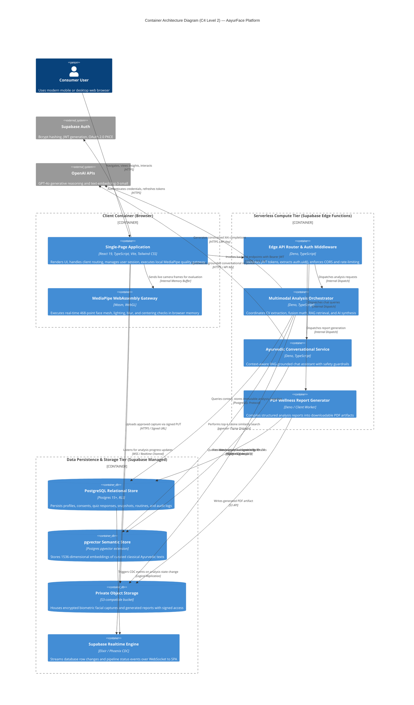

# AayurFace — Architecture Specification
## Container Architecture (C4 Level 2) & 26 Logical Bounded Contexts

**Phase:** Phase 02 — Target System Architecture, ADRs & Implementation Blueprint  
**Date:** 2026-09-03  
**Status:** FORMAL ARCHITECTURAL SPECIFICATION  
**Authority:** Solution Architect, Staff Backend Architect, Staff Frontend Architect  

---

### 1. Container Architecture Overview

The Container Architecture decomposes the AayurFace platform into high-level executable units of deployment and data persistence.

---

### 2. The 26 Logical Bounded Contexts & Module Inventory

AayurFace defines 26 discrete bounded contexts to ensure modularity, high cohesion, and low coupling. These modules are logically organized across the system without introducing unnecessary distributed microservice complexity:

| Module # | Bounded Context / Domain | Primary Execution Tier | Architectural Responsibility | Key Interfaces & Dependencies |
|---|---|---|---|---|
| **01** | **Identity & Access** | External / Client Auth | User registration, login, session refresh, password reset, and OAuth identity mediation. | Supabase Auth SDK, `AuthContext`, JWT Bearer tokens |
| **02** | **User Profile** | Frontend & Database | Manages user display name, demographics (age, gender), concerns, and language preferences. | `profiles` table, Profile API |
| **03** | **Consent & Privacy** | Frontend, Backend, DB | Enforces unbundled consent collection, audit logging, revocation, and automated deletion. | `consents` table, Consent Middleware |
| **04** | **Onboarding** | Frontend SPA | Manages the 7-step onboarding state machine and intake progression. | Onboarding State Machine, Local Storage Cache |
| **05** | **Ayurvedic Questionnaire** | Frontend, Backend, DB | Collects 15-question constitutional intake, maps options to Tridosha vectors, computes scores. | `questionnaire_responses`, Scoring Engine |
| **06** | **Lifestyle Context** | Frontend, Backend, DB | Collects diet, sleep, stress, climate, hydration; normalizes environmental aggravation vectors. | `lifestyle_contexts`, Context Normalizer |
| **07** | **Capture Quality Gateway** | Client Browser (Wasm) | Evaluates live video frames for lighting, distance, centering, blur, and single face in volatile RAM. | MediaPipe Face Mesh, Quality State Machine |
| **08** | **Image Processing** | Serverless Edge Function | Validates uploaded image format, dimensions, color profiles, and prepares ROI sub-regions. | Image Decoder, Canvas ROI Extractor |
| **09** | **Facial Feature Extraction** | Serverless Edge Function | Computes objective numerical indices: CIELAB $a^*$ redness, GLCM texture roughness, pigmentation variance. | Numerical Feature Extraction Pipeline |
| **10** | **Skin Signal Analysis** | Serverless Edge Function | Categorizes extracted numerical signals into qualitative wellness markers (e.g., surface warmth, lipid shine). | Signal Categorization Matrix |
| **11** | **Ayurvedic Intelligence** | Serverless Edge Function | Encapsulates domain logic relating observed signals to classical dosha tendencies (Prakriti / Vikriti). | Classical Ayurvedic Taxonomies |
| **12** | **Multimodal Fusion** | Serverless Edge Function | Executes configurable weighted combination of Visual, Questionnaire, and Lifestyle vectors. | Fusion Engine, Weight Configuration Registry |
| **13** | **Confidence Engine** | Serverless Edge Function | Calculates inter-modality cosine agreement, assigns agreement states (High/Med/Low), and computes confidence score. | Cosine Agreement Math, Uncertainty Flagging |
| **14** | **Explainability (XAI)** | Serverless Edge Function | Formulates the 5-part structured explanation schema citing observations, context, agreement, and disclaimers. | XAI Prompt Engine, Schema Validator |
| **15** | **Knowledge / RAG** | Edge Function & DB | Vectorizes queries, retrieves top-$k$ classical citations from `pgvector`, and injects verified sources. | `knowledge_chunks`, `text-embedding-3-small` |
| **16** | **Personalization** | Serverless Edge Function | Filters recommendation candidates by user skin concerns, dominant dosha, and lifestyle goals. | Personalization Matching Engine |
| **17** | **Recommendations** | Serverless Edge Function | Formats actionable herbal recipes, instructions, frequency, and mandatory 24h patch-test notices. | Recommendation Schema Validator |
| **18** | **Routine Management** | Frontend & Database | Manages Morning, Evening, and Weekly ritual schedules and logs daily user adherence. | `routines`, `routine_tracking` tables |
| **19** | **Voice Assistant** | Client & Serverless (V2) | Integrates browser Web Speech API with backend RAG chat service for hands-free voice interactions. | Web Speech API, `ayurveda-chat` Edge Function |
| **20** | **Localization (i18n)** | Frontend SPA | Manages bilingual runtime (English + Hindi) with extensible regional translation bundles and fonts. | `i18next`, Devanagari Typography Loader |
| **21** | **Analysis History** | Frontend & Database | Provides an immutable timeline of historical analysis snapshots with RLS isolation. | `scan_results` table, History Service |
| **22** | **Longitudinal Progress** | Frontend & Database (V2) | Computes delta metrics and renders 30/60/90-day progress charts across visual signals and adherence. | Recharts Analytics Engine, `progress_checkpoints` |
| **23** | **PDF / Export** | Serverless / Client Worker | Compiles structured analysis results into a downloadable PDF report with embedded citations and disclaimers. | PDF Generation Library |
| **24** | **Notifications** | Scheduled Worker (V2) | Sends scheduled routine reminders and checkpoint notifications based on user opt-in preferences. | Notification Delivery Worker |
| **25** | **Research & Validation** | Admin / Research (R&D) | Manages expert consensus annotation queues, gold-standard labels, and Fitzpatrick bias audits. | `research_datasets`, `consensus_labels` |
| **26** | **Audit & Observability** | Cross-Cutting Infra | Emits structured JSON logs with correlation IDs (`x-correlation-id`), performance metrics, and redaction. | Observability Pipeline, Sentry / Logging Hook |

---

### 3. Module Categorization by Execution Runtime

To avoid architectural sprawl, these 26 bounded contexts are mapped directly into four concrete execution environments:

1. **Client-Side SPA Modules:**
   - Identity Client (`01`), Onboarding (`04`), Capture Gateway (`07`), Voice UI (`19`), Localization (`20`), History View (`21`), Progress UI (`22`), Client Telemetry (`26`).
2. **Serverless Edge Function Services:**
   - Identity Router & Auth Middleware (`01`), Consent Verification (`03`), Questionnaire Scorer (`05`), Lifestyle Normalizer (`06`), Image Processing (`08`), Feature Extraction (`09`), Skin Signal Analysis (`10`), Ayurvedic Domain Reasoning (`11`), Multimodal Fusion (`12`), Confidence Engine (`13`), XAI Generator (`14`), RAG Retrieval (`15`), Personalization (`16`), Recommendation Formatter (`17`), PDF Generation (`23`), Structured Logging (`26`).
3. **Database Relational & Vector Tier:**
   - Profile Storage (`02`), Consent Records (`03`), Questionnaire Responses (`05`), Lifestyle Contexts (`06`), Immutable Snapshots (`10`, `12`, `14`), Vector Knowledge Base (`15`), Routines & Tracking (`18`), Research Datasets (`25`).
4. **Private Storage Tier:**
   - Biometric Captures (`07`, `08`), PDF Reports (`23`).

---

### 4. Architectural Boundary Invariant: Logical Bounded Contexts ≠ Microservices

> [!IMPORTANT]
> **Modular Monolith as the Default Deployment Model**  
> Defining 26 logical bounded contexts does **NOT** mean deploying 26 independent microservices. The target architecture strictly preserves a **Modular Monolith** as the default application deployment model:
> * All frontend modules reside within a single cohesive React SPA repository with clean feature-directory isolation (`src/features/*`).
> * All backend logic resides within cohesive Supabase Edge Functions sharing a unified deployment pipeline and database connection pool.
> * Services should only be extracted into independent physical microservices if future runtime telemetry demonstrates that extreme scale, strict security isolation, or specialized hardware workloads (e.g., custom GPU-accelerated PyTorch training daemons) explicitly justify the added operational and network complexity.
