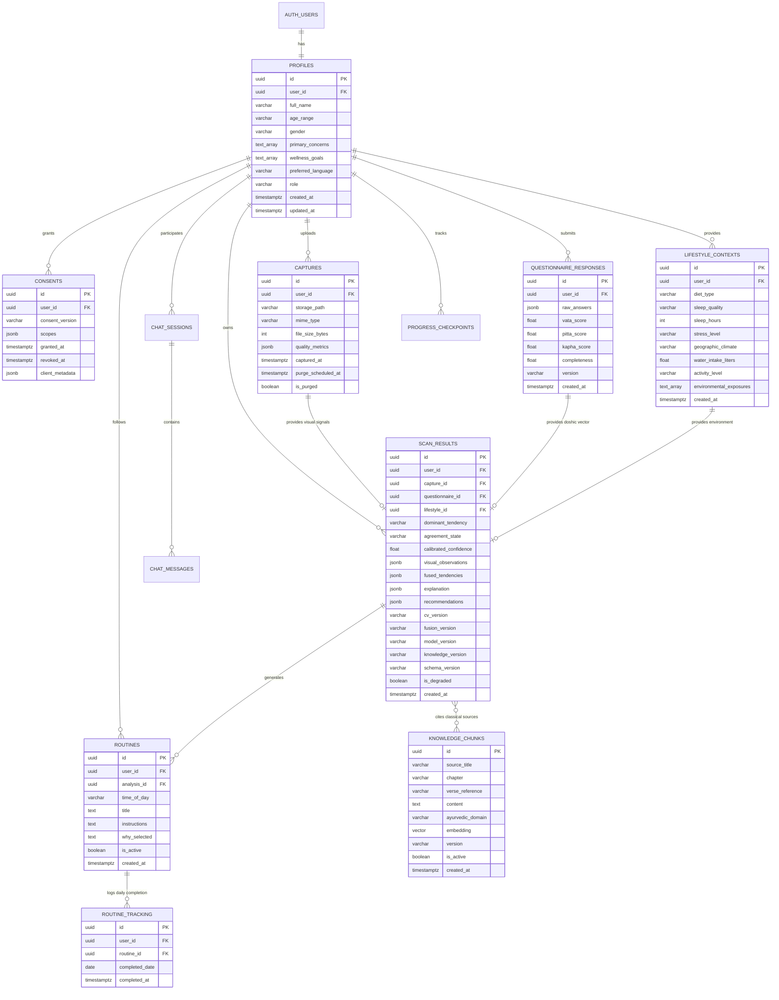

# AayurFace — Architecture Specification
## Target Data Architecture, Relational Models & Storage Lifecycle

**Phase:** Phase 02 — Target System Architecture, ADRs & Implementation Blueprint  
**Date:** 2026-09-03  
**Status:** FORMAL ARCHITECTURAL SPECIFICATION  
**Authority:** Data Architect, Security & Privacy Architect  

---

### 1. Conceptual Domain Data Model

The data architecture establishes an unambiguous separation between raw biometric captures, derived mathematical features, immutable holistic wellness assessments, and curated classical knowledge.

---

### 2. Entity Schema Blueprints & Responsibilities

#### A. Core Identity & Legal Entities
1. **`profiles`:** Extended profile details linked 1:1 with `auth.users`. Contains display name, age range, gender, skin concerns, and preferred UI language. Protected by RLS (`auth.uid() = user_id`).
2. **`consents`:** Immutable audit log of informed consent transactions. Tracks unbundled scopes (`biometric_processing`, `analysis_storage`, `research_sharing`, `reminders`), client metadata hash, and revocation timestamps.

#### B. Input Modality Entities
3. **`questionnaire_responses`:** Stores normalized 15-question constitutional intake. Calculates phenotypic Tridosha signal ($V + P + K = 1.0$) and stores questionnaire version for longitudinal tracking.
4. **`lifestyle_contexts`:** Stores environmental, sleep, diet, hydration, and stress variables with deterministic downstream doshic relevance.
5. **`captures`:** Storage reference entity tracking image file metadata, client quality gateway verification tokens, and scheduled cryptographic purge timestamps.

#### C. Analysis Snapshot & Routine Entities
6. **`scan_results` (Immutable Analysis Snapshot):** Central analytical record. Binds visual observations, fused dosha scores, confidence, agreement status, 5-part XAI explanations, and version metadata. Strict invariant: Read-only once created; updates are forbidden by RLS.
7. **`routines` & `routine_tracking`:** Daily ritual prescriptions (Morning/Evening/Weekly) generated from analysis snapshots and daily user completion checkboxes.
8. **`progress_checkpoints`:** Longitudinal trend aggregates (30, 60, 90 days) comparing baseline and subsequent analyses across visual signal deltas and routine adherence.

#### D. Knowledge & RAG Entities
9. **`knowledge_chunks`:** Curated, cited classical literature (*Charaka Samhita*, *Sushruta Samhita*, *Bhavaprakasha*). Houses 1536-dimensional vector embeddings managed by `pgvector`.
10. **`chat_sessions` & `chat_messages`:** Context-aware conversational threads with message role (`user`, `assistant`), cited classical sources, and safety notices.

---

### 3. Data Sensitivity Classification & Retention Policies

| Entity / Asset | Sensitivity Level | Encryption In-Transit | Encryption At-Rest | Retention Window | Deletion & Purging Strategy |
|---|---|---|---|---|---|
| **Raw Facial Captures** | **Sensitive Biometric Data** | TLS 1.3 | AES-256 (S3 SSE) | **OPEN DECISION (DEC-004)** (Immediate vs 30 Days vs Opt-in) | S3 API Hard Purge + soft-delete reference update. |
| **`profiles`** | Confidential / PII | TLS 1.3 | AES-256 (TDE) | Account Lifetime | Cascading delete upon account deletion. |
| **`consents`** | Regulatory / Compliance | TLS 1.3 | AES-256 (TDE) | Account Lifetime + 1 Year | Soft-deleted; permanent archive for legal defense. |
| **`questionnaire_responses`** | Special Category Health | TLS 1.3 | AES-256 (TDE) | Account Lifetime | Cascading delete upon account deletion. |
| **`lifestyle_contexts`** | Personal Wellness Data | TLS 1.3 | AES-256 (TDE) | Account Lifetime | Cascading delete upon account deletion. |
| **`scan_results`** | Wellness Insight / Metric | TLS 1.3 | AES-256 (TDE) | Account Lifetime | Cascading delete upon account deletion. |
| **`knowledge_chunks`** | Public Classical Literature | TLS 1.3 | AES-256 (TDE) | Indefinite (Versioned) | Admin deprecation (`is_active = false`). |
| **`audit_logs`** | System Telemetry | TLS 1.3 | AES-256 (TDE) | 90 Days Rolling | Automated rolling partition purge; no PII. |
