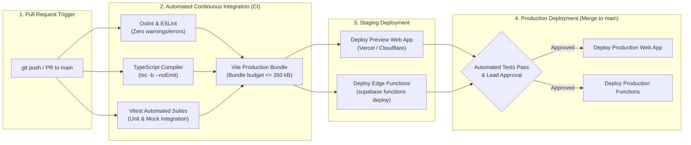

# AayurFace — Architecture Specification
## Target Deployment, Environments & CI/CD Pipeline Architecture

**Phase:** Phase 02 — Target System Architecture, ADRs & Implementation Blueprint  
**Date:** 2026-09-03  
**Status:** FORMAL ARCHITECTURAL SPECIFICATION  
**Authority:** Platform/SRE Architect, DevOps Lead  

---

### 1. Multi-Stage Deployment Environments

AayurFace enforces complete isolation across three standard environments to ensure that development experiments and staging tests cannot access production databases or leak user biometric captures:

```text
┌─────────────────────────────────────────────────────────────────────────────────┐
│                           MULTI-STAGE ENVIRONMENT TOPOLOGY                      │
│                                                                                 │
│   [Local Development] ──► [Staging / Preview] ──► [Production Environment]      │
│   • Local Vite dev        • Vercel Preview PRs    • Vercel Production CDN       │
│   • Supabase CLI Local    • Supabase Staging Proj • Supabase Production Proj    │
│   • Mock / Local Secrets  • Isolated Staging DB   • Production Postgres & RLS   │
│   • Headless Vitest       • Automated E2E Tests   • Strict Monitoring & Alarms  │
└─────────────────────────────────────────────────────────────────────────────────┘
```

---

### 2. Environment Configuration & Secret Isolation Matrix

| Configuration Variable | Local Dev (`.env.local`) | Staging Environment | Production Environment | Sensitivity / Storage Location |
|---|---|---|---|---|
| `VITE_SUPABASE_URL` | `http://127.0.0.1:54321` | `https://staging-proj.supabase.co` | `https://prod-proj.supabase.co` | Public Client Env (Vercel Build Var) |
| `VITE_SUPABASE_ANON_KEY` | Local Anon Key | Staging Anon Key | Production Anon Key | Public Client Env (Vercel Build Var) |
| `SUPABASE_SERVICE_ROLE_KEY` | Local Service Key | Staging Service Key (GitHub Secret) | Production Service Key (GitHub Secret)| Restricted Secret (CI/CD Deployment Only) |
| `OPENAI_API_KEY` | Personal / Sandbox Key | Staging Team Key (Quota Capped) | Production Enterprise Secret | Critical Secret (Supabase Edge Secrets Only) |
| `ALLOWED_ORIGIN` | `http://localhost:5173` | `https://staging.aayurface.app` | `https://aayurface.app` | Security CORS Config (Edge Function Env) |

*Strict Invariant:* Production API keys and database credentials shall NEVER be committed to git or exposed in client bundles.

---

### 3. Automated CI/CD Pipeline Architecture (GitHub Actions)

Every pull request and merge to `main` executes an automated validation pipeline:



---

### 4. Zero-Downtime Rollback & Database Migration Safety

* **Blue/Green Static Hosting:** Vercel/Cloudflare static web hosting provides instant atomic rollbacks to previous build hashes with zero downtime if client regression is detected.
* **Non-Destructive Database Migrations:** Database schema migrations must follow an **Expand and Contract pattern**:
  1. *Expand:* Add new nullable columns or new tables.
  2. *Deploy:* Deploy code reading and writing the new columns.
  3. *Backfill:* Asynchronously migrate existing records.
  4. *Contract:* Safely drop deprecated columns in a subsequent release.
  *Destructive schema drops in production are strictly forbidden during live service.*
