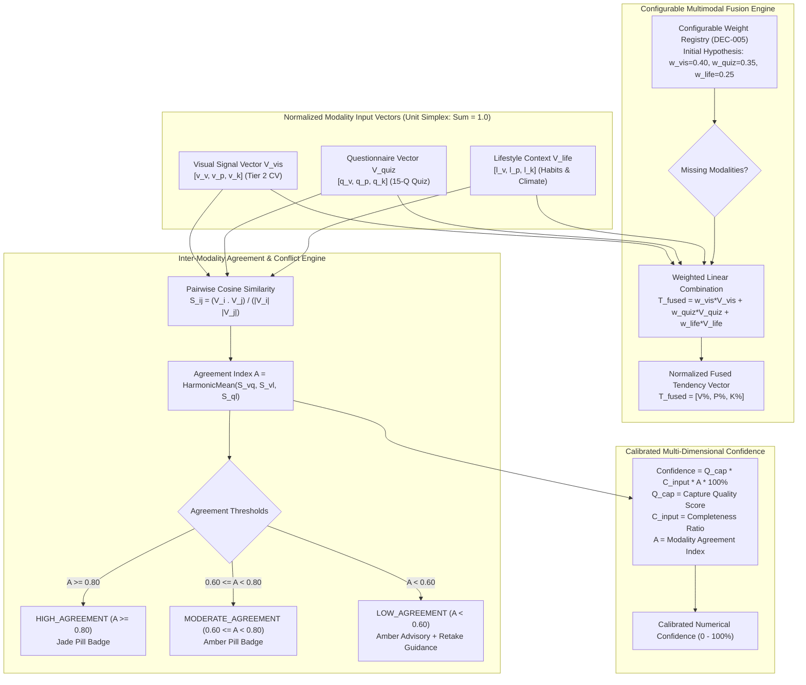

# AayurFace — Architecture Specification
## Multimodal Fusion & Confidence Engine Architecture

**Phase:** Phase 02 — Target System Architecture, ADRs & Implementation Blueprint  
**Date:** 2026-09-03  
**Status:** FORMAL ARCHITECTURAL SPECIFICATION  
**Authority:** AI/ML Architect, Solution Architect  

---

### 1. Multimodal Fusion Engine Architecture

AayurFace combines three distinct, independent modalities to synthesize constitutional skin intelligence. Crucially, the architecture **does not hardcode fixed weights as immutable dogma**; it implements a configurable, versioned strategy pattern.

---

### 2. Configurable Weighting Strategy & Hypothesis Status (DEC-005)

* **Architecture Requirement:** The fusion layer shall load weighting parameters dynamically from an active `FusionConfiguration` entity rather than hardcoding static floats in application code.
* **Prototyping Working Hypothesis:**
  $$w_{vis} = 0.40, \quad w_{quiz} = 0.35, \quad w_{life} = 0.25$$
* **Reconciliation Constraint:** As established in Phase 01-C, these weights are an unvalidated working hypothesis. The system must support empirical calibration against expert consensus datasets during the Research Phase without refactoring core fusion interfaces.
* **Strategy Extensibility:** The architecture encapsulates fusion behind an `IFusionStrategy` interface, permitting seamless substitution with advanced models (e.g., Bayesian Belief Networks or Latent Class Models) in future research versions.

---

### 3. Inter-Modality Agreement & Conflict Detection

When input modalities indicate conflicting signals (e.g., visual analysis detects high Pitta inflammation, but constitutional intake reflects high Vata dryness), the system must never manufacture false certainty.

1. **Pairwise Cosine Similarity:**
   $$S_{ij} = \frac{\vec{V}_i \cdot \vec{V}_j}{\|\vec{V}_i\| \|\vec{V}_j\|}, \quad \text{for } \{i, j\} \in \{\text{vis}, \text{quiz}, \text{life}\}$$
2. **Harmonic Mean Agreement Index ($A$):**
   $$A = \frac{3}{\frac{1}{S_{vq}} + \frac{1}{S_{vl}} + \frac{1}{S_{ql}}}$$
3. **Discrete Agreement Thresholds:**
   * **`HIGH_AGREEMENT` ($A \ge 0.80$):** Modalities strongly align; displayed with a Soft Jade badge.
   * **`MODERATE_AGREEMENT` ($0.60 \le A < 0.80$):** Minor variance across secondary traits; displayed with an Amber badge.
   * **`LOW_AGREEMENT` ($A < 0.60$):** Significant divergence detected; displayed with an Amber Warning Card explicitly informing the user of mixed evidence and providing retake/review options.

---

### 4. Calibrated Confidence Scoring Formula

Confidence in AayurFace is a deterministic, observable calculation rather than an arbitrary LLM estimation:

$$\text{Confidence} = Q_{cap} \times C_{input} \times A \times 100\%$$

* **$Q_{cap} \in [0.70, 1.0]$:** Capture Quality Score evaluated by the MediaPipe client gateway (luminance, sharpness, pose alignment).
* **$C_{input} \in [0.50, 1.0]$:** Input Data Completeness Ratio (percentage of completed questions and optional lifestyle fields).
* **$A \in [0.0, 1.0]$:** Inter-Modality Harmonic Agreement Index.

#### Invariant:
If $A < 0.60$, the maximum stated confidence is mathematically capped at $< 60\%$, guaranteeing that conflicting inputs can never produce an erroneously high confidence score.
