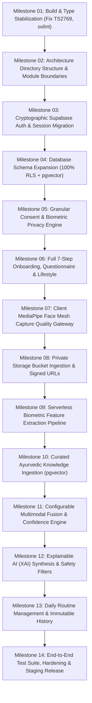

# AayurFace — Architecture Specification
## Implementation Blueprint: Current → Transition → Target Migration Architecture

**Phase:** Phase 02 — Target System Architecture, ADRs & Implementation Blueprint  
**Date:** 2026-09-03  
**Status:** FORMAL ARCHITECTURAL SPECIFICATION  
**Authority:** Principal Software Architect, Solution Architect  
**Implementation Constraint:** ARCHITECTURE PLANNING ONLY (Zero Implementation in Phase 02)  

---

### 1. Phased Migration Strategy

Because AayurFace currently exists as a partially functioning client prototype, transitioning directly to the target architecture in a single release carries extreme risk. The migration architecture decomposes the transition into **14 disciplined, testable milestones**:



---

### 2. Milestone Execution Blueprint & Dependencies

| Milestone # | Target Capability | Current State | Architectural Scope | Key Dependencies | Verification Gate |
|---|---|---|---|---|---|
| **M01** | **Build & Type Stabilization** | `npm run build` fails (TS2769 in `vite.config.ts`); 6 linter warnings. | Resolve `vite.config.ts` Vitest triple-slash typing; eliminate all oxlint warnings; enforce clean `tsc -b && vite build`. | None | `npm run build` passes with zero errors and zero warnings. |
| **M02** | **Module Boundary Refactoring** | Tightly coupled pages; mock data mixed with UI components. | Reorganize `src/` into feature-based modules (`features/auth`, `features/capture`, `features/analysis`). | M01 | Clean build; zero circular dependencies; zero logic breakage. |
| **M03** | **Supabase Auth Migration** | Mock `localStorage` ignoring passwords; fake sessions. | Decommission mock auth; integrate Supabase Auth SDK (email/password + Google OAuth PKCE); protect routes. | M02, Supabase Project | Genuine login/signup with bcrypt hashing; valid JWT sessions. |
| **M04** | **Database Schema Expansion** | 7 basic tables; missing 6 major domain tables; no pgvector. | Execute migrations for `consents`, `questionnaire_responses`, `lifestyle_contexts`, `routines`, `knowledge_chunks`; enable 100% RLS. | M03, PostgreSQL 15 | All tables exist with RLS policies; cross-tenant queries fail with 0 rows. |
| **M05** | **Consent & Privacy Engine** | Zero consent in UI or database. | Implement `/onboarding/consent` with unbundled checkboxes; persist immutable records in `consents` table; gate capture. | M04 | Capture blocked until consent granted; withdrawal triggers purge. |
| **M06** | **Onboarding, Quiz & Lifestyle** | 3 hardcoded skin concerns; zero dosha questionnaire. | Implement 7-step onboarding flow; 15-question dosha wizard with V/P/K vector calculation; lifestyle intake form. | M05 | Normalized Tridosha vector ($V+P+K=1.0$) stored in database. |
| **M07** | **MediaPipe Capture Gateway** | 3-second `setTimeout` mock capture; zero quality checks. | Integrate MediaPipe Face Mesh WebAssembly; build real-time lighting, centering, distance, blur evaluators; gate capture button. | M06, WebRTC API | "Capture" enabled only when all checks pass; dynamic corrective alerts. |
| **M08** | **Private Storage & Signed URLs** | Images sent as raw base64; no storage architecture. | Deploy `facial-captures` private bucket; build `POST /capture-upload-url` Edge Function with 15-minute signed URLs. | M07, Supabase Storage | Direct client-to-storage upload; public URL access blocked (HTTP 403). |
| **M09** | **Biometric Feature Extraction** | Uncalled generic GPT-4o Vision wrapper. | Implement deterministic CV feature worker (CIELAB $a^*$ redness, GLCM texture, melanin uniformity); output `VisualObservations`. | M08, Deno / Python | Normalized visual observation vector generated from capture. |
| **M10** | **Classical Knowledge Ingestion** | Hardcoded mock remedy array; no RAG. | Chunk classical Ayurvedic texts; generate `text-embedding-3-small` embeddings; store in `knowledge_chunks` with HNSW index. | M04, OpenAI API | Top-5 semantic similarity query returns verified classical citations. |
| **M11** | **Multimodal Fusion & Confidence** | Static "94% Confidence" mock string. | Deploy configurable fusion engine ($w_{vis}, w_{quiz}, w_{life}$); build pairwise cosine agreement engine and calibrated confidence formula. | M06, M09 | Fused tendency vector calculated; agreement state (High/Med/Low) assigned. |
| **M12** | **Explainable AI & Safety** | Generic static explanation text. | Build constrained GPT-4o XAI prompt; enforce 5-part explanation schema, classical citations, and mandatory 24h patch test warnings. | M10, M11 | Structured `AnalysisResult` generated; non-diagnostic disclaimer verified. |
| **M13** | **Routines & Immutable History** | Mock scan timeline; static routines. | Persist analysis snapshots in `scan_results`; generate Morning/Evening/Weekly routines; build daily completion tracking. | M12 | User can browse historical analyses and toggle daily routine checkboxes. |
| **M14** | **E2E Testing & Hardening** | 1 test file (`Logo.test.tsx`, 2 tests). | Author automated Vitest unit test suites for all domain services; build Playwright E2E smoke tests; configure CI/CD. | M01–M13, GitHub Actions | Automated CI pipeline passes 100% tests; production staging deployment verified. |

---

### 3. Existing Codebase Classification Matrix

Every existing application and service file in the repository (excluding static public image assets and root developer configs) has been audited and classified under one of four categories:
* **KEEP (15 files):** File is production-ready or matches target architectural standards with minimal adjustments.
* **REWORK (22 files):** File contains salvageable presentation or utility logic but requires refactoring to conform to target contracts.
* **REPLACE (6 files):** File implements mock, unauthenticated, or placeholder logic and must be rewritten completely.
* **REMOVE (1 file):** File is obsolete, dead code, or redundant with target architecture primitives.
* **TOTAL RECONCILED COUNT: 15 (KEEP) + 22 (REWORK) + 6 (REPLACE) + 1 (REMOVE) = 44 FILES.**

| # | File Path | Current Role in Prototype | Classification | Target Architectural Disposition & Rationale |
|---|---|---|---|---|
| 01 | `package.json` | Project dependencies & scripts | **REWORK** | Retain scripts; resolve Vitest typing dependencies; audit React 19 compatibility (DEC-001). |
| 02 | `vite.config.ts` | Vite bundler & Vitest test block | **REWORK** | Fix `/// <reference types="vitest" />` typing error (TS2769); configure path aliases (`@/features`, `@/lib`). |
| 03 | `tsconfig.json` | Base TypeScript configuration | **KEEP** | Standard strict TypeScript base configuration; add path alias mappings. |
| 04 | `tsconfig.app.json` | Application TypeScript configuration | **KEEP** | Standard strict TypeScript application configuration; ensure clean build. |
| 05 | `src/main.tsx` | React SPA entry point | **KEEP** | Clean standard entry point mounting `App.tsx` and query client. |
| 06 | `src/App.tsx` | Root component with providers | **REWORK** | Replace mock AuthProvider with genuine Supabase AuthProvider; inject i18n localization wrapper. |
| 07 | `src/index.css` | Global Tailwind CSS styles | **REWORK** | Update theme colors from Material Green to PRD Section 4 Terracotta/Sage heritage tokens (DEC-002). |
| 08 | `src/routes/index.tsx` | Central route registry | **REWORK** | Restructure routes into feature modules; wire protected route guards to real session state. |
| 09 | `src/routes/guards.tsx` | Mock route protection | **REPLACE** | Replace `localStorage` checks with genuine Supabase JWT session verification and onboarding step completion guards. |
| 10 | `src/contexts/AuthContext.tsx` | Mock authentication provider | **REPLACE** | **CRITICAL SECURITY REPLACEMENT:** Decommission `localStorage` password-ignoring mock; implement genuine Supabase Auth. |
| 11 | `src/lib/supabase.ts` | Supabase JS client init | **KEEP** | Standard client initialization using `createClient(VITE_SUPABASE_URL, VITE_SUPABASE_ANON_KEY)`. |
| 12 | `src/lib/utils.ts` | UI class concatenation (`cn`) | **KEEP** | Standard `clsx` + `tailwind-merge` utility; fully reusable. |
| 13 | `src/lib/mockData.ts` | Static mock responses & remedies | **REMOVE** | Remove once Supabase database and pgvector RAG are wired; retain temporarily in tests as fixture data. |
| 14 | `src/components/common/Logo.tsx` | Brand SVG logo component | **KEEP** | Clean SVG presentation component. |
| 15 | `src/components/common/Logo.test.tsx` | Unit test for Logo component | **KEEP** | Sole passing automated test suite in repository; retain as baseline test fixture. |
| 16 | `src/components/common/LoadingSpinner.tsx` | UI loading indicator | **KEEP** | Accessible SVG spinner primitive. |
| 17 | `src/components/common/SafetyNotice.tsx` | Non-diagnostic disclaimer card | **REWORK** | Update copy to match mandatory disclaimer text in `BR-AI-001` with 24h patch test notice. |
| 18 | `src/components/common/SkinBadge.tsx` | Visual skin tag pill | **KEEP** | Reusable UI pill component. |
| 19 | `src/components/common/ShimmerCard.tsx` | Skeleton loading placeholder | **KEEP** | Accessible skeleton state primitive. |
| 20 | `src/components/common/AyurCard.tsx` | Card container primitive | **REWORK** | Harmonize border radius and shadow tokens with Ayurvedic design system. |
| 21 | `src/components/layout/TopBar.tsx` | Header navigation | **REWORK** | Wire user profile dropdown to Supabase session state and sign-out handler. |
| 22 | `src/components/layout/BottomNav.tsx` | Mobile navigation bar | **REWORK** | Harmonize navigation tabs with target routes (`/dashboard`, `/capture`, `/routines`, `/history`, `/profile`). |
| 23 | `src/components/layout/Sidebar.tsx` | Desktop side navigation | **REWORK** | Harmonize navigation links and active route states. |
| 24 | `src/components/layout/AuthLayout.tsx` | Wrapper for login/register | **KEEP** | Clean responsive card layout for auth flows. |
| 25 | `src/components/layout/PageWrapper.tsx` | Responsive page container | **KEEP** | Standard padding and viewport constraints. |
| 26 | `src/components/layout/PageTransition.tsx` | Framer Motion page wrapper | **KEEP** | Fluid subtle fade transition primitive. |
| 27 | `src/pages/public/LandingPage.tsx` | Public marketing landing view | **REWORK** | Update hero copy, screenshots, and CTAs to reflect authenticated onboarding and Tridosha scanning. |
| 28 | `src/pages/public/LoginPage.tsx` | User login form | **REWORK** | Replace mock submit with `supabase.auth.signInWithPassword` and Google OAuth PKCE button; add Zod validation. |
| 29 | `src/pages/public/RegisterPage.tsx` | User sign-up form | **REWORK** | Replace mock submit with `supabase.auth.signUp`; add password strength meter and age verification checkbox (DEC-003). |
| 30 | `src/pages/public/ForgotPasswordPage.tsx` | Password reset request | **REWORK** | Wire to `supabase.auth.resetPasswordForEmail`. |
| 31 | `src/pages/onboarding/OnboardingPage.tsx` | 3-concern intake wizard | **REPLACE** | Replace with full 7-step onboarding flow: Welcome -> Age -> Consent -> 15-Q Constitutional Quiz -> Lifestyle -> Goals -> Ready. |
| 32 | `src/pages/app/HomePage.tsx` | App dashboard | **REWORK** | Wire dynamic data from `scan_results` and `routines`; replace mock status cards with real user data. |
| 33 | `src/pages/app/ScanPage.tsx` | Camera & scan trigger | **REPLACE** | **CRITICAL PIPELINE REPLACEMENT:** Remove 3s setTimeout; integrate MediaPipe Wasm quality gateway, real-time guides, and signed upload. |
| 34 | `src/pages/app/ResultsPage.tsx` | Analysis results display | **REWORK** | Restructure to render 5-part XAI schema, Tridosha percentage breakdown, inter-modality agreement pill, and patch test warning. |
| 35 | `src/pages/app/ChatPage.tsx` | Conversational assistant | **REPLACE** | Decommission static `if/else` checks; wire to `/api/v1/chat/message` RAG endpoint with classical citations. |
| 36 | `src/pages/app/LibraryPage.tsx` | Classical remedies encyclopedia | **REWORK** | Wire to query vetted herbs from `knowledge_chunks` rather than static mock arrays. |
| 37 | `src/pages/app/RemedyDetailPage.tsx` | Single remedy view | **REWORK** | Display classical source attribution, ingredients, preparation steps, and mandatory patch-test notice. |
| 38 | `src/pages/app/ProfilePage.tsx` | User profile & settings | **REWORK** | Wire to `profiles` table; add language selector (EN/HI), consent revocation, and account deletion request. |
| 39 | `src/pages/app/EditProfilePage.tsx` | Profile editing form | **REWORK** | Wire form fields to Supabase `profiles` update with RLS protection. |
| 40 | `src/pages/NotFoundPage.tsx` | 404 error page | **KEEP** | Clean standard fallback view. |
| 41 | `src/test/setup.ts` | Vitest environment setup | **KEEP** | Standard jsdom and `@testing-library/jest-dom` configuration. |
| 42 | `supabase/schema.sql` | 7-table initial DB schema | **REWORK** | Expand schema to add `consents`, `questionnaire_responses`, `lifestyle_contexts`, `routines`, `knowledge_chunks`, and enable RLS on all user tables. |
| 43 | `supabase/functions/analyze-skin/` | Unauthenticated GPT-4o function | **REPLACE** | **CRITICAL BACKEND REPLACEMENT:** Decommission wildcard CORS function; implement authenticated `/api/v1/analysis/orchestrate`. |
| 44 | `supabase/functions/ayurveda-chat/` | Unauthenticated chat function | **REWORK** | Add JWT auth verification, strict CORS whitelist, rate-limiting, and pgvector classical chunk retrieval injection. |

---

### 4. Implementation Ordering & Dependency Constraints

Execution must follow this strict topological order:

```text
[M01: Build Fix]
       │
       ▼
[M02: Module Boundaries]
       │
       ▼
[M03: Supabase Auth & JWT] ──► [M04: Schema Expansion & 100% RLS]
                                       │
                                       ▼
                             [M05: Consent Engine]
                                       │
                                       ▼
                       [M06: Onboarding, Quiz & Lifestyle]
                                       │
                                       ▼
                       [M07: MediaPipe Client Gateway]
                                       │
                                       ▼
                       [M08: Private Storage & Signed PUT]
                                       │
                                       ▼
                       [M09: Serverless CV Extraction]
                                       │
                                       ▼
                       [M10: Classical pgvector RAG Ingest]
                                       │
                                       ▼
                       [M11: Configurable Fusion & Confidence]
                                       │
                                       ▼
                       [M12: Explainable AI & Safety Guards]
                                       │
                                       ▼
                       [M13: Routine Engine & History Timeline]
                                       │
                                       ▼
                       [M14: E2E Automation, Hardening & Staging]
```
