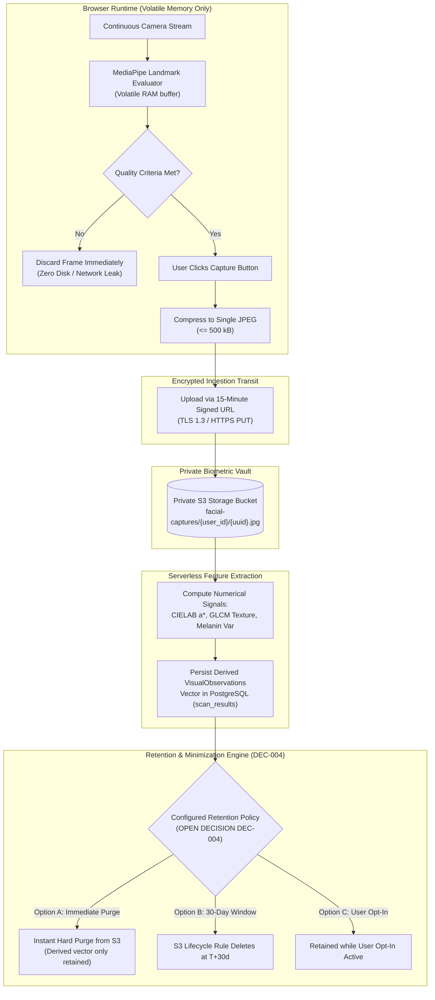

# AayurFace — Architecture Specification
## Privacy Architecture, Biometric Data Minimization & Consent Lifecycle

**Phase:** Phase 02 — Target System Architecture, ADRs & Implementation Blueprint  
**Date:** 2026-09-03  
**Status:** FORMAL ARCHITECTURAL SPECIFICATION  
**Authority:** Security & Privacy Architect, Compliance Systems Analyst  
**Regulatory Boundary Notice:** Designed to support applicable privacy obligations (including India's Digital Personal Data Protection Act 2023 and GDPR Article 9 principles); formal legal and regulatory review required.  

---

### 1. Privacy-by-Design Architectural Framework

In AayurFace, facial imagery and derived physiological observations represent sensitive biometric and health-related personal data. The privacy architecture is structured around five foundational pillars:

```text
1. Explicit Granular Consent     ──► Unbundled, affirmative consent prior to biometric capture
2. Ephemeral Processing          ──► Video stream evaluated in volatile browser RAM only
3. Data Minimization             ──► Biometric extraction reduces high-res images to numerical vectors
4. User-Controlled Lifecycle     ──► User-initiated deletion, consent withdrawal, and data export
5. Cryptographic Storage Fence   ──► Zero-read private storage buckets with short-lived signed URLs
```

---

### 2. The Biometric Processing Lifecycle



---

### 3. Granular Consent Lifecycle Architecture

In alignment with DPDP Act 2023 principles (privacy architecture is designed to support applicable data-protection obligations; formal legal and compliance review is required), consent is never bundled or coerced:
1. **Unbundled Scopes:** The onboarding wizard presents separate, independent consent toggles:
   * `biometric_processing`: Permission to analyze facial features for Ayurvedic skin characteristics. (Mandatory to run scan).
   * `analysis_storage`: Permission to store analysis results and routines in user history.
   * `research_sharing`: Permission to contribute de-identified, aggregated feature metrics to academic research. (Strictly optional).
   * `routine_reminders`: Permission to send scheduled wellness notifications. (Strictly optional).
2. **Immutable Audit Record:** Every consent event is written to the `consents` table with user ID, consent schema version, granted scopes, client metadata hash, and timestamp.
3. **Consent Withdrawal & Hard Purge:**
   * A user can revoke any consent scope at any time via `/profile/settings`.
   * Revocation of `biometric_processing` or account deletion triggers an automated cascading purge:
     1. Active facial captures in `facial-captures` are permanently hard-deleted via S3 API.
     2. Relational records in `profiles`, `questionnaire_responses`, `lifestyle_contexts`, and `scan_results` are deleted.
     3. An immutable tombstone entry is logged in `consents` with `revoked_at = NOW()`.

---

### 4. Retention Policy Classifications (DEC-004)

The retention period for raw facial captures is explicitly classified as an **OPEN DECISION (DEC-004)**:
* **Option A (Architecturally Recommended for Privacy): Immediate Purge.** The raw JPEG is deleted from object storage within 60 seconds of successful feature extraction. Longitudinal tracking operates solely on the derived numerical vector (`VisualObservations`), eliminating biometric data exposure.
* **Option B: 30-Day Rolling Retention.** Retain the raw image for 30 days to allow users to visually inspect skin changes, followed by automated lifecycle deletion.
* **Option C: User Opt-In Toggle.** Allow individual users to select their preferred retention window in account settings.

*Regulatory Standard:* No definitive retention period is declared as final until formal legal counsel reviews local biometric privacy liabilities.
