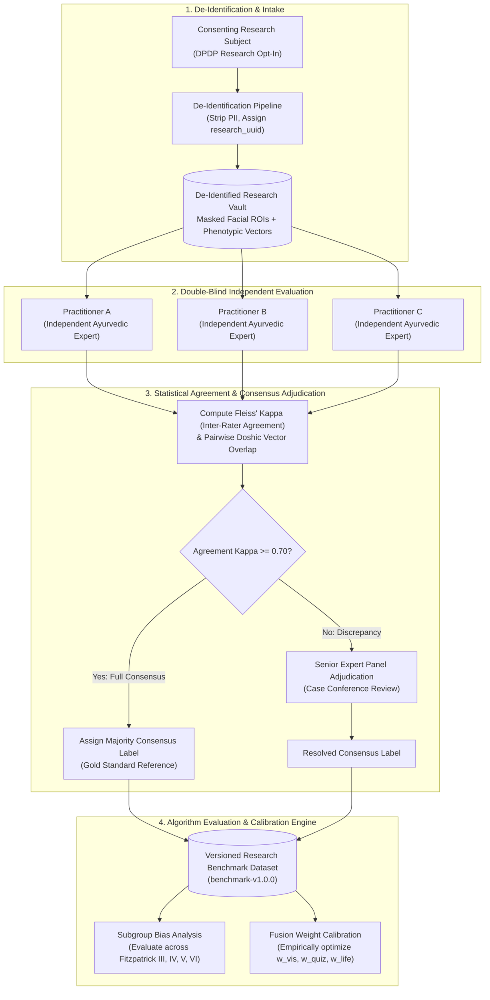

# AayurFace — Architecture Specification
## Ayurvedic Research, Expert Consensus & Bias Audit Architecture

**Phase:** Phase 02 — Target System Architecture, ADRs & Implementation Blueprint  
**Date:** 2026-09-03  
**Status:** FORMAL ARCHITECTURAL SPECIFICATION  
**Authority:** AI/ML Architect, Principal Product Engineer, Research Systems Analyst  
**Development Reality Notice:** This document specifies the target architecture for the FUTURE post-MVP Research Phase. Do not claim the research platform or annotation portal currently exists in the codebase.  

---

### 1. Research Protocol Principles & Motivation

As documented in `AayurFace Research.pdf`, modern computer vision and dermatological AI models suffer from two foundational gaps:
1. **The Fitzpatrick III–VI Representation Gap:** Most dermatological datasets are skewed towards lighter Western phototypes (Fitzpatrick I–II), producing higher error rates and misclassifications on darker Indian skin tones.
2. **Subjectivity of Ayurvedic Typologies:** In the absence of standardized objective guidelines, individual Ayurvedic practitioners often evaluate Tridosha balances with variable subjective criteria.

The research architecture formalizes an empirical **Triple-Practitioner Consensus Pipeline** to establish gold-standard reference datasets for algorithm calibration and fairness audits.

---

### 2. The Triple-Practitioner Consensus Pipeline



---

### 3. Data Schema Specifications for Research Entities

```sql
-- Architectural Blueprint for Future Research Entities (Not for immediate migration)

CREATE TABLE research_subjects (
    id UUID PRIMARY KEY DEFAULT gen_random_uuid(),
    consent_id UUID NOT NULL REFERENCES consents(id),
    fitzpatrick_phototype VARCHAR(10) NOT NULL, -- 'III', 'IV', 'V', 'VI'
    age_bracket VARCHAR(20) NOT NULL,
    gender VARCHAR(20) NOT NULL,
    created_at TIMESTAMPTZ NOT NULL DEFAULT NOW()
);

CREATE TABLE expert_annotations (
    id UUID PRIMARY KEY DEFAULT gen_random_uuid(),
    subject_id UUID NOT NULL REFERENCES research_subjects(id),
    practitioner_id UUID NOT NULL,
    assigned_vata_pct NUMERIC(5,2) NOT NULL,
    assigned_pitta_pct NUMERIC(5,2) NOT NULL,
    assigned_kapha_pct NUMERIC(5,2) NOT NULL,
    annotated_at TIMESTAMPTZ NOT NULL DEFAULT NOW()
);

CREATE TABLE consensus_labels (
    id UUID PRIMARY KEY DEFAULT gen_random_uuid(),
    subject_id UUID NOT NULL REFERENCES research_subjects(id),
    fleiss_kappa NUMERIC(4,3) NOT NULL,
    consensus_vata_pct NUMERIC(5,2) NOT NULL,
    consensus_pitta_pct NUMERIC(5,2) NOT NULL,
    consensus_kapha_pct NUMERIC(5,2) NOT NULL,
    is_adjudicated BOOLEAN NOT NULL DEFAULT FALSE,
    dataset_version VARCHAR(50) NOT NULL,
    created_at TIMESTAMPTZ NOT NULL DEFAULT NOW()
);
```

---

### 4. Fitzpatrick Subgroup Bias Audit Protocol

Before any future computer vision model or fusion weight configuration is baselined for production, it must undergo automated subgroup evaluation:
* **Equalized Odds Invariant:** The false-positive erythema rate on Fitzpatrick V–VI skin tones must not deviate by more than $\pm 5\%$ compared to Fitzpatrick III skin tones under identical standardized capture gateway illumination.
* **Continuous Calibration Tracking:** Inter-modality agreement rates and confidence distributions are logged continuously across all demographic cohorts to detect algorithmic drift.
