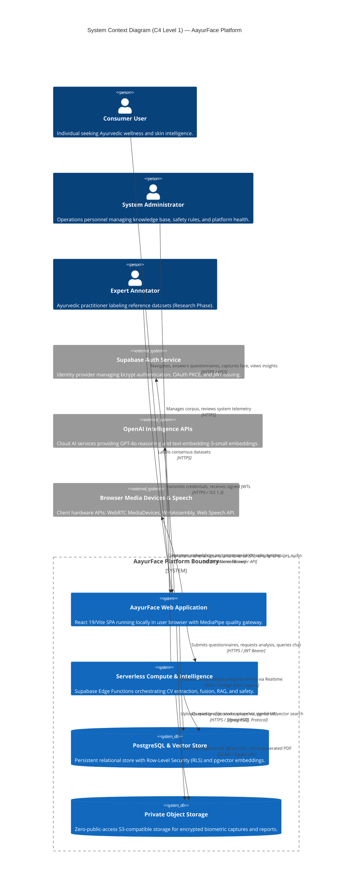

# AayurFace — Architecture Specification
## System Context Architecture (C4 Level 1) & Trust Boundaries

**Phase:** Phase 02 — Target System Architecture, ADRs & Implementation Blueprint  
**Date:** 2026-09-03  
**Status:** FORMAL ARCHITECTURAL SPECIFICATION  
**Authority:** Solution Architect, Security Architect  

---

### 1. System Context Overview

The System Context diagram illustrates the high-level boundary of the AayurFace platform, defining how human actors and external systems interact with the platform while delineating explicit trust boundaries.



---

### 2. Primary Actors & System Roles

1. **Consumer End-User:** Primary operator interacting via mobile or desktop web browser. Performs onboarding, informed consent submission, constitutional intake, face capture, routine management, and report export. Operates strictly on personal data under authenticated session boundaries.
2. **Platform Administrator:** Privileged operator accessing role-gated administrative portals (`/admin`). Manages the classical Ayurvedic knowledge corpus, inspects operational telemetry, configures safety rules, and triggers vector re-embedding. Zero access to consumer facial imagery.
3. **Expert Annotator (Research Scope):** Certified Ayurvedic practitioner participating in double-blind consensus labeling. Reviews anonymized image patches and de-identified questionnaire vectors to assign validated reference labels. Zero access to consumer PII.
4. **Researcher (Research Scope):** Academic analyst querying de-identified, aggregated demographic cohorts (Fitzpatrick skin tone distributions) for algorithm bias audits. Zero access to individual user identities.

---

### 3. Trust Boundaries & Security Envelopes

The system defines four distinct trust zones:

```text
┌────────────────────────────────────────────────────────────────────────┐
│  TRUST ZONE 1: UNTRUSTED CLIENT PERIMETER (Browser Runtime)            │
│  • DOM, React Components, User Input Fields, Local Storage             │
│  • Ephemeral video frame buffer (Volatile RAM only)                    │
│  • THREAT: XSS, client tampering, token theft, falsified client state  │
└───────────────────────────────────┬────────────────────────────────────┘
                                    │ TLS 1.3 + JWT Bearer
                                    ▼
┌────────────────────────────────────────────────────────────────────────┐
│  TRUST ZONE 2: SERVERLESS APPLICATION PERIMETER (Edge Functions)       │
│  • Stateless Deno execution environment                                │
│  • Decodes & verifies JWT signature; extracts `auth.uid()`             │
│  • Holds server-side environment secrets (`OPENAI_API_KEY`)            │
│  • THREAT: Injection attacks, unauthorized access, SSRF, DoS           │
└───────────────────┬────────────────────────────────┬───────────────────┘
                    │ PostgreSQL Protocol            │ S3 API (Signed)
                    ▼                                ▼
┌──────────────────────────────────────┐ ┌───────────────────────────────┐
│ TRUST ZONE 3: DATA PERSISTENCE       │ │ TRUST ZONE 4: OBJECT STORAGE  │
│ (Managed PostgreSQL 15+)             │ │ (Supabase Storage Bucket)     │
│ • Database tables & pgvector store   │ │ • Zero public access          │
│ • RLS: `USING (auth.uid() = user_id)`│ │ • Cryptographic signed URLs   │
│ • THREAT: SQLi, cross-tenant data    │ │ • THREAT: Public bucket leak  │
└──────────────────────────────────────┘ └───────────────────────────────┘
```

#### Trust Boundary Rules:
1. **The Client is Untrusted:** The serverless layer never trusts client-provided identity parameters (`userId`). Authorization is derived solely from the cryptographically verified JWT payload (`auth.uid()`).
2. **AI Output is Untrusted:** Data returned by external LLM services (OpenAI GPT-4o) is treated as untrusted third-party input. It must pass strict Zod schema validation and deterministic safety regex filters before being persisted or delivered to the client.
3. **Biometric Storage Isolation:** Captured facial frames are isolated in private buckets accessible only through temporary signed URLs with a maximum Time-to-Live of 15 minutes. Public bucket listing or reads are blocked at the storage configuration layer.

---

### 4. Sensitive Data Flows

| Data Flow ID | Payload Description | Source | Destination | Protocol / Protection | Security & Privacy Control |
|---|---|---|---|---|---|
| **DF-001** | User Credentials (Login/Register) | Client Browser | Supabase Auth | HTTPS / TLS 1.3 | Passwords bcrypt-hashed; never logged or stored in plaintext. |
| **DF-002** | Session JWT Token | Supabase Auth | Client Browser | HTTPS / Memory Storage | Asymmetric JWT with 60-minute TTL; automatic background rotation. |
| **DF-003** | Continuous Camera Stream | Device Camera | Browser Canvas | Ephemeral RAM | Processed in volatile memory only; frames never written to disk or sent to server. |
| **DF-004** | Single Approved Biometric Frame | Client Browser | Private Storage | HTTPS / Signed PUT | Direct upload to `facial-captures/{user_id}/{uuid}.jpg` via short-lived signed URL. |
| **DF-005** | Constitutional & Lifestyle Answers | Client Browser | Edge Functions | HTTPS / JWT Bearer | Validated against Zod schema; persisted in RLS-protected database tables. |
| **DF-006** | Vector Knowledge Query & Chunks | Edge Functions | PostgreSQL pgvector | TLS / Internal Net | Cosine distance search over vetted classical literature; no PII transmitted. |
| **DF-007** | Generative XAI Synthesis Prompt | Edge Functions | OpenAI API | HTTPS / Bearer Secret | PII stripped; contains normalized feature vectors and classical chunks only. |
| **DF-008** | Realtime Progress Telemetry | PostgreSQL CDC | Client Browser | WSS / TLS 1.3 | Scoped to the user's specific `analysis_id` channel; no sensitive data leaked. |
