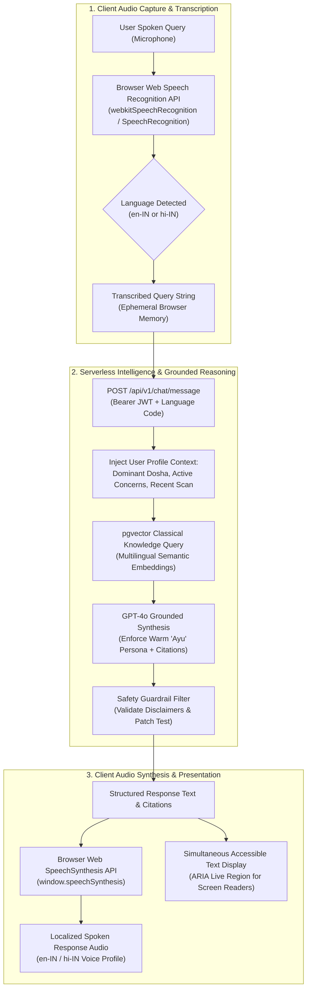

# AayurFace — Architecture Specification
## Voice Assistant & Multilingual Architecture

**Phase:** Phase 02 — Target System Architecture, ADRs & Implementation Blueprint  
**Date:** 2026-09-03  
**Status:** FORMAL ARCHITECTURAL SPECIFICATION  
**Authority:** Frontend Architect, AI/ML Architect, Localization Lead  
**Scope Classification:** Core UI Localization (English + Hindi) is MVP Scope (DEC-007); Hands-Free Voice Assistant is V2 Scope.  

---

### 1. Multilingual & Localization Architecture

AayurFace is designed from the ground up for Indian linguistic diversity. The architecture completely separates user-interface copy, domain questionnaire schemas, and classical knowledge text from core application logic:

```text
┌─────────────────────────────────────────────────────────────────────────────────┐
│                          LOCALIZATION RUNTIME (Browser SPA)                     │
│                                                                                 │
│   Language Selector ──► i18next Runtime Engine ──► Devanagari Typography Loader │
│                                │                                                │
│              ┌─────────────────┴─────────────────┐                              │
│              ▼                                   ▼                              │
│   [English Locale Bundle: `en`]        [Hindi Locale Bundle: `hi`]              │
│   • JSON Key-Value UI Strings          • Native Devanagari Script UI Strings    │
│   • Latin Typography (Inter/Sans)      • Noto Sans Devanagari Web Fonts         │
│   • 15-Question Constitutional Intake  • 15-Question Constitutional Intake (HI) │
└─────────────────────────────────────────────────────────────────────────────────┘
```

#### Invariant: Safety Consistency Across Languages
Changing the UI language or conversational language NEVER alters the underlying safety constraints:
* The 24-hour patch test directive (`FR-REC-003`) is permanently enforced in both English and Hindi.
* The non-diagnostic disclaimer (`BR-AI-001`) is presented with equivalent legal clarity in all supported languages.
* Emergency medical escalation keywords (e.g., severe rash, bleeding, acute allergic reaction) trigger dermatologist referral notices identically across all languages.

---

### 2. Conversational Voice Assistant Architecture (V2 Pipeline)

The hands-free conversational voice assistant enables users to interact with "Ayu" (the Ayurvedic wellness companion) while applying face masks or preparing herbal remedies:



---

### 3. Voice Error Handling & Fallback Protocols

| Error Condition | Root Cause | Client Handling & Recovery Behavior |
|---|---|---|
| **Microphone Denied** | User blocked audio permission in browser. | Fallback to text keyboard input; display friendly audio permission recovery guide. |
| **Speech API Unsupported** | Legacy browser without Web Speech API. | Automatically hide microphone button; render standard chat input field without error dialogs. |
| **Low Confidence Transcription** | Background noise or heavy ambient interference. | Audio prompt: *"I didn't quite catch that. Could you please repeat or type your question?"* |
| **Language Mismatch** | User speaks in Hindi while English profile active. | Dynamic language detection switches TTS speech synthesis profile to match spoken language. |
| **Network Latency Spike** | RAG response exceeds 4 seconds. | Client triggers immediate gentle auditory acknowledgement (*"Looking up classical Ayurvedic texts for you..."*) while streaming response. |
