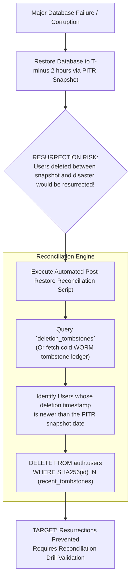

# AayurFace — Database Architecture Specification
## Backup Architecture, Disaster Recovery & Tombstone Reconciliation

**Phase:** Phase 04 — Database & Data Architecture  
**Date:** 2026-09-03  
**Status:** FORMAL ARCHITECTURAL SPECIFICATION (Target Design; Implementation Pending)  
**Authority:** Principal Database Architect, Platform/SRE Architect  

---

### 1. Target & Proposed Recovery Objectives (RPO & RTO)

> [!NOTE]
> **Status:** **TARGET / PROPOSED OBJECTIVES (REQUIRES INFRASTRUCTURE VALIDATION)**.  
> These metrics represent architectural design objectives, NOT currently verified production guarantees or binding SLAs. Full validation requires disaster recovery failover testing in staging.

| Metric | Target Architecture Objective | Proposed Engineering Strategy | Validation Requirement |
|---|---|---|---|
| **Recovery Point Objective (RPO)** | $\le 5\text{ minutes}$ (Target Objective) | Continuous Write-Ahead Log (WAL) archiving to encrypted multi-region S3 storage. | Requires PITR restoration latency benchmark. |
| **Recovery Time Objective (RTO)** | $\le 60\text{ minutes}$ (Target Objective) | Automated infrastructure-as-code (Terraform) provisioning of replica instances with PITR playback. | Requires automated disaster recovery drill. |

---

### 2. Physical Backup Architecture

```text
┌─────────────────────────────────────────────────────────────────────────────┐
│ 1. DAILY FULL SNAPSHOTS (PostgreSQL Physical Snapshot)                      │
│ Automated daily physical volume snapshot executed at 02:00 UTC.             │
│ Snapshot encrypted with AWS KMS customer-managed keys (AES-256).            │
│ Retention: Rolling 30 days; snapshots older than 30 days automatically roll off.│
└──────────────────────────────────────┬──────────────────────────────────────┘
                                       │
┌──────────────────────────────────────┴──────────────────────────────────────┐
│ 2. CONTINUOUS WRITE-AHEAD LOG (WAL) ARCHIVAL                                │
│ PostgreSQL WAL segments continuously streamed and archived to S3.           │
│ Enables Point-in-Time Recovery (PITR) to any specific minute within 30 days.│
└──────────────────────────────────────┬──────────────────────────────────────┘
                                       │
┌──────────────────────────────────────┴──────────────────────────────────────┐
│ 3. BIOMETRIC OBJECT EXCLUSION                                               │
│ Raw facial images (`facial-captures/`) are deliberately EXCLUDED from database│
│ relational backups. S3 has independent multi-AZ redundancy and lifecycle rules.│
└─────────────────────────────────────────────────────────────────────────────┘
```

---

### 3. Post-Restoration Tombstone Reconciliation Protocol



* **Target Drill Schedule:** Disaster recovery and tombstone reconciliation procedures shall be tested in staging once every quarter (**PROPOSED / REQUIRES VALIDATION**).
* **Implementation Requirement:** The post-restore reconciliation script is a **TARGET SPECIFICATION (REQUIRES IMPLEMENTATION & INFRASTRUCTURE TESTING)**.
