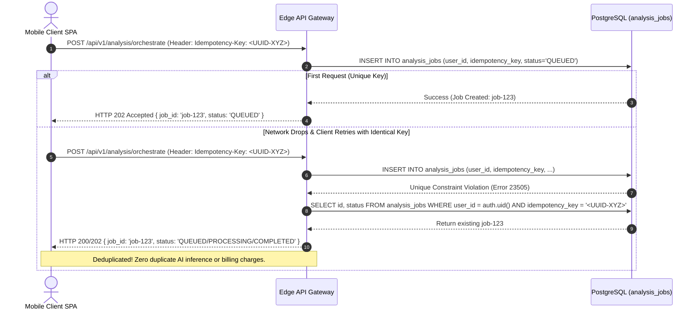

# AayurFace — Database Architecture Specification
## Idempotency Architecture & Request Deduplication

**Phase:** Phase 04 — Database & Data Architecture  
**Date:** 2026-09-03  
**Status:** FORMAL ARCHITECTURAL SPECIFICATION (Target Design; Implementation Pending)  
**Authority:** Principal Database Architect, Staff Backend Architect  

---

### 1. The Idempotency Contract

Flaky cellular mobile connections frequently cause network timeouts where the client does not know whether an HTTP POST request succeeded. Without idempotency, automatic client retries trigger duplicate OpenAI model calls, deplete cloud budgets, and create redundant duplicate rows in user histories:

---

### 2. Idempotency Key Specifications

1. **Header Name:** `Idempotency-Key` (Mandatory for state-mutating POST endpoints: `/analysis/orchestrate`, `/captures/upload-url`, `/reports/export`).
2. **Key Format:** UUIDv4 generated by client application before transmission.
3. **Database Constraint:** `UNIQUE (user_id, idempotency_key)` on `analysis_jobs`.
4. **Window of Expiration:** Idempotency keys are cached at the edge (or active in DB) for **120 seconds**. Subsequent retries within 120 seconds receive the cached status or result snapshot without re-executing inference.
5. **Worker Task Retry Idempotency:** Background workers retry failed analysis jobs using deterministic update queries (`UPDATE ... WHERE id = :job_id AND status = 'RETRYING'`), ensuring that multiple worker threads can never execute the same job attempt in parallel.
