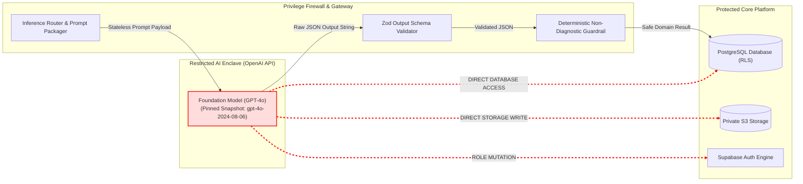

# AayurFace — Security Architecture Specification
## AI Threat Modeling, Output Validation & Privilege Boundaries

**Phase:** Phase 03 — Enterprise Security, Privacy, Threat Modeling & AI Safety Architecture  
**Date:** 2026-09-03  
**Status:** FORMAL ARCHITECTURAL SPECIFICATION (Target Design; Implementation Pending)  
**Authority:** AI/ML Architect, Principal Security Architect, Ayurvedic Intelligence Lead  

---

### 1. The Untrusted Subsystem Invariant

Within AayurFace, artificial intelligence and foundation models (e.g., OpenAI GPT-4o) are treated as **untrusted, non-deterministic computational enclaves**:
* Models can be manipulated by malicious user prompt injections.
* Models can hallucinate false certainty, invent non-existent classical citations, or generate unsafe medical diagnoses.
* Under NO circumstances shall an AI model possess direct database write credentials, execute privileged API commands, or bypass application-level authorization gates.

---

### 2. The AI Privilege Firewall

The architecture establishes an impermeable privilege boundary between the AI model and the backend infrastructure:



#### Firewall Rules:
1. **Zero Database Credentials:** The model is never passed PostgreSQL connection strings, Supabase service-role keys, or arbitrary SQL execution tools.
2. **Read-Only Context Ingestion:** The model receives only static, pre-filtered context vectors. It cannot request arbitrary cross-tenant data.
3. **Stateless Operations:** All model requests are executed statelessly (`store: false`). The model retains zero conversational history between separate user sessions.

---

### 3. Structured Output Contract & Fail-Closed Validation

Every AI analysis response must conform to an immutable, strongly-typed Zod output schema:

```typescript
export const AnalysisOutputSchema = z.object({
  dominant_dosha: z.enum(['VATA', 'PITTA', 'KAPHA', 'VATA_PITTA', 'PITTA_KAPHA', 'VATA_KAPHA', 'TRIDOSHIC']),
  doshic_percentages: z.object({
    vata: z.number().min(0).max(100),
    pitta: z.number().min(0).max(100),
    kapha: z.number().min(0).max(100),
  }),
  visual_observations: z.object({
    erythema_signal: z.string().max(300),
    surface_texture_signal: z.string().max(300),
    pigmentation_uniformity: z.string().max(300),
  }),
  inter_modality_agreement: z.enum(['HIGH_AGREEMENT', 'MODERATE_AGREEMENT', 'LOW_AGREEMENT']),
  calibrated_confidence: z.number().min(0).max(100),
  classical_citations: z.array(z.object({
    work: z.enum(['Charaka Samhita', 'Sushruta Samhita', 'Ashtanga Hridaya', 'Bhavaprakasha']),
    section: z.string().max(100),
    verse: z.string().max(50),
    translation_excerpt: z.string().max(500),
  })).min(1).max(5),
  actionable_rituals: z.array(z.object({
    ritual_name: z.string().max(100),
    timing: z.enum(['MORNING', 'EVENING', 'WEEKLY']),
    instructions: z.string().max(500),
    contraindications: z.string().max(300),
  })).min(1).max(5),
  mandatory_safety_notice: z.string().min(50),
  model_metadata: z.object({
    model_version: z.string(),
    prompt_version: z.string(),
    knowledge_version: z.string(),
  }),
}).strict();
```

#### Fail-Closed Handlers:
If the model returns malformed JSON, omits classical citations, or violates the schema:
* **Immediate Rejection:** The output is flagged as invalid and dropped.
* **Fallback Response:** The user is rendered a pre-verified, deterministic fallback Ayurvedic guideline card.
* **Audit Event:** Emits `AI_OUTPUT_VALIDATION_FAILED` to the security log.

---

### 4. False Certainty & Confidence Security

Manufacturing false certainty on low-quality biometric inputs is a critical safety failure:
* **The Gating Invariant:** If the capture quality gateway records poor lighting ($Q_{cap} < 0.60$) or inter-modality agreement detects conflict ($A < 0.60$), the system **FORBIDS** high-confidence scores.
* **The Confidence Cap:** Under `LOW_AGREEMENT`, confidence is mathematically capped at $< 60\%$. The UI permanently highlights an uncertainty advisory banner: *"Visual surface signals and constitutional questionnaire answers show differing doshic tendencies. Prioritize your constitutional lifestyle routine over surface observations."*
