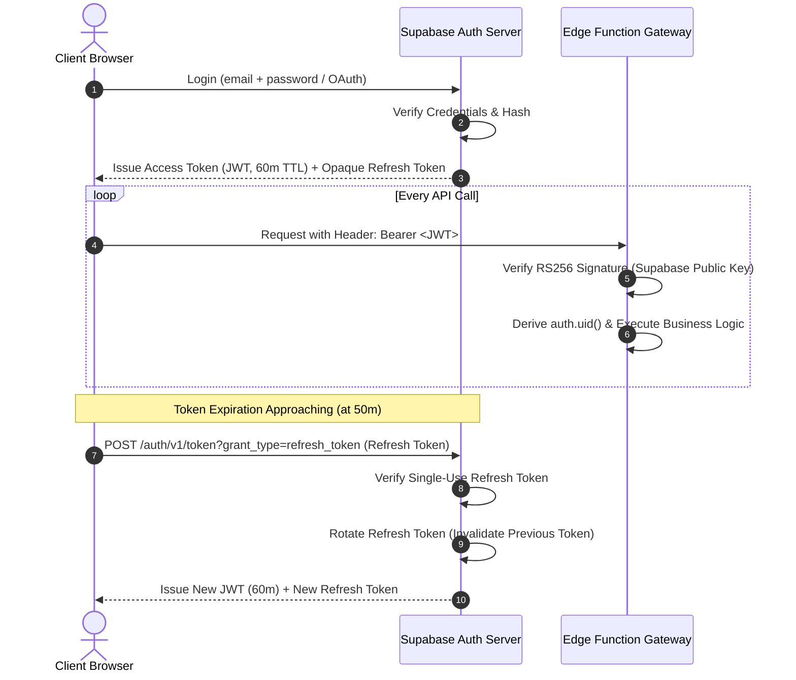

# AayurFace — Security Architecture Specification
## Identity, Authentication & Session Security Architecture

**Phase:** Phase 03 — Enterprise Security, Privacy, Threat Modeling & AI Safety Architecture  
**Date:** 2026-09-03  
**Status:** FORMAL ARCHITECTURAL SPECIFICATION (Target Design; Implementation Pending)  
**Authority:** Security Architect, Staff Backend Architect, Principal Software Architect  

---

### 1. Conceptual Separation of Concerns

The architecture establishes an absolute separation between authentication, authorization, and resource ownership:

```text
┌─────────────────────────────────────────────────────────────────────────────┐
│ 1. IDENTITY & AUTHENTICATION ("Who are you?")                                │
│ Proved via Supabase Auth: Valid email/password (bcrypt) or Google OAuth PKCE│
│ Output: Cryptographically signed RS256 JWT containing `sub = userId`.        │
└──────────────────────────────────────┬──────────────────────────────────────┘
                                       │
                                       ▼
┌─────────────────────────────────────────────────────────────────────────────┐
│ 2. AUTHORIZATION & RBAC ("What role do you hold?")                           │
│ Verified by Edge API Gateway: `role = authenticated | admin | researcher`.    │
│ Being "logged in" NEVER grants access to arbitrary user data.               │
└──────────────────────────────────────┬──────────────────────────────────────┘
                                       │
                                       ▼
┌─────────────────────────────────────────────────────────────────────────────┐
│ 3. RESOURCE OWNERSHIP ("Do you own this specific record?")                   │
│ Enforced by PostgreSQL Kernel RLS: `USING (auth.uid() = user_id)`.           │
│ Physical multi-tenant isolation: Target user cannot access User B's records.│
└─────────────────────────────────────────────────────────────────────────────┘
```

---

### 2. Identity Provider & Authentication Mechanism

* **Managed Identity Provider:** Supabase Auth is selected as the primary identity provider (ADR-012), decommissioning the insecure prototype `localStorage` mock.
* **Password Hashing Standard:** Passwords are never stored in plain text. Hashing is managed by PostgreSQL `pgcrypto` utilizing **bcrypt** (work factor: 10) or **Argon2id**.
* **OAuth 2.0 / OIDC Integration:** Google OAuth utilizes **PKCE (Proof Key for Code Exchange)** to prevent authorization code interception on mobile browsers.
* **Identity Immutability:** Once a user account is provisioned, their internal UUID (`id` in `auth.users`) is permanent and immutable. All domain tables reference this UUID exclusively as a foreign key.

---

### 3. Session Model & Token Lifecycle



#### Token Security Specifications:
* **Access Token (JWT):**
  * **Algorithm:** RS256 (Asymmetric RSA signature; private key held in Supabase vault, public key cached at Edge API Gateway).
  * **Payload Claims:** `sub` (User UUID), `aud` (`authenticated`), `role` (`authenticated`), `exp` (1 hour expiration timestamp), `iat` (Issued at timestamp).
  * **Ephemeral Storage:** Access tokens are maintained exclusively in client browser RAM or short-lived memory contexts. Storing raw tokens in unencrypted `localStorage` without XSS mitigations is prohibited.
* **Refresh Token:**
  * **Format:** Opaque 256-bit cryptographically secure random string.
  * **Rotation Policy:** Single-use automatic token rotation. Each refresh operation issues a new refresh token and immediately invalidates the consumed token.
  * **Replay Detection:** If an invalidated refresh token is presented, the auth server immediately flags the session as compromised and revokes all active family refresh tokens for that user account.

---

### 4. Authentication Defense Controls

| Threat Vector | Attack Scenario | Architectural Defense Control | Status |
|---|---|---|---|
| **Credential Stuffing / Brute Force** | Attacker scripts millions of password attempts against `/auth/v1/token`. | Progressive exponential delay per IP/email; account lock for 15 minutes after 5 consecutive failed attempts; IP-based WAF rate limiting. | Target Control |
| **Session Fixation** | Attacker forces a pre-set session ID onto a victim prior to login. | Auth engine completely regenerates session identifiers and cryptographic tokens upon successful authentication. | Target Control |
| **Token Theft via XSS** | Attacker injects malicious script to extract authentication credentials. | Strict Content Security Policy (CSP) blocking unauthorized script domains; token lifetimes capped at 60 minutes; token rotation. | Target Control |
| **Account Enumeration** | Attacker uses registration or password reset responses to identify registered emails. | Generic, uniform responses: *"If an account exists for this email, a verification link has been dispatched."* | Target Control |
| **Session Revocation / Logout** | User clicks "Sign Out" or initiates password reset. | Explicit revocation call deletes server-side refresh token; client purges local in-memory token state; all active sessions can be globally terminated via `auth.signOut({ scope: 'global' })`. | Target Control |
