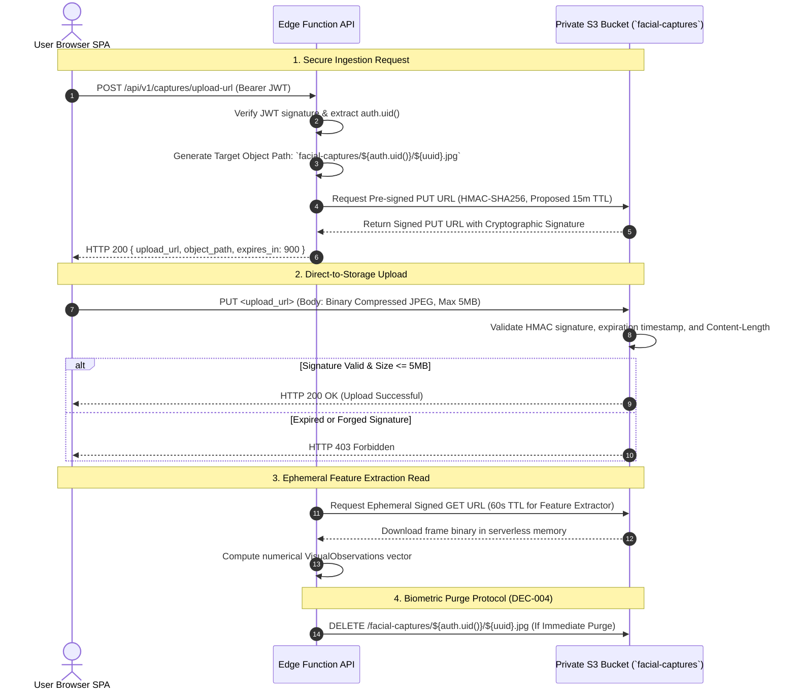

# AayurFace — Security Architecture Specification
## Object Storage & Cryptographic Pre-Signed Access Security

**Phase:** Phase 03 — Enterprise Security, Privacy, Threat Modeling & AI Safety Architecture  
**Date:** 2026-09-03  
**Status:** FORMAL ARCHITECTURAL SPECIFICATION (Target Design; Implementation Pending)  
**Authority:** Security Architect, Platform/SRE Architect, Staff Backend Architect  

---

### 1. Private Bucket Storage Architecture

To completely eliminate unauthorized exposure of sensitive facial biometric data, Supabase Storage (S3-compatible) is configured with private bucket access rules:

```text
┌─────────────────────────────────────────────────────────────────────────────┐
│ S3 STORAGE BUCKET: `facial-captures` (PRIVATE)                               │
│ • Public Read Access: DISABLED (Direct HTTP GET returns 403 Forbidden)      │
│ • Public Listing Access: DISABLED (Bucket enumeration physically blocked)    │
│ • Path Isolation Scheme: `facial-captures/{userId}/{captureId}.jpg`          │
│ • Server-Side Encryption: AES-256 (KMS-Managed Encryption at Rest)           │
└─────────────────────────────────────────────────────────────────────────────┘
```

---

### 2. Cryptographic Pre-Signed URL Access Lifecycle



---

### 3. Object Storage Security Specifications

| Control Area | Security Specification | Threat Addressed | Verification Method |
|---|---|---|---|
| **Public URL Prohibition** | Public bucket reads are disabled at the storage API layer. | Direct image scraping, search engine indexing. | Automated test: Direct unauthenticated HTTP GET must return `403 Forbidden`. |
| **Tenant Path Isolation** | Objects are partitioned by user UUID: `{userId}/{captureId}.jpg`. Upload URL generation verifies that the path prefix matches `auth.uid()`. | Cross-tenant overwriting, BOLA/IDOR file tampering. | Unit test verifying User A cannot obtain signed upload URL for User B's path. |
| **Proposed Signed URL TTL** | Upload URLs expire after 15 minutes; download URLs for serverless extraction expire after 60 seconds (SEC-DEC-003: Proposed). | Intercepted or forwarded link reuse. | Clock skew test verifying signed URL fails after expiration timestamp. |
| **MIME & Size Enforcement** | Enforce `Content-Type: image/jpeg` and `Content-Length <= 5242880` (5 MB). | Decompression bombs, storage exhaustion, malicious executables. | Attempting to upload a 10 MB payload or `.html` file is rejected. |
| **Automated Orphan Cleanup** | Daily scheduled storage worker scans for uploaded files older than 24 hours that are not linked to a completed `scan_results` record. | Orphaned file accumulation, unlinked biometric storage liability. | Staging audit verifying unlinked test captures are hard-purged after 24 hours. |
| **Audit Telemetry** | Every generation of a signed upload or download URL is logged with `user_id`, `object_path`, and `expires_at`. | Forensic investigations, unauthorized access tracking. | Verification of `OBJECT_SIGNED_URL_CREATED` event emission in audit log. |
