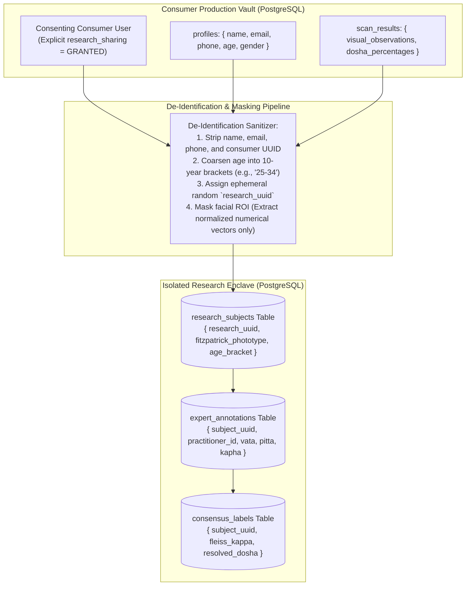

# AayurFace — Security Architecture Specification
## Clinical Research Platform & Expert Consensus Security

**Phase:** Phase 03 — Enterprise Security, Privacy, Threat Modeling & AI Safety Architecture  
**Date:** 2026-09-03  
**Status:** FORMAL ARCHITECTURAL SPECIFICATION (Target Design; Implementation Pending)  
**Authority:** Principal Security Architect, AI/ML Architect, Research Systems Analyst  
**Development Reality Notice:** Specifies target security controls for the FUTURE post-MVP Research Phase (DEC-010). The research platform does NOT currently exist in the codebase.  

---

### 1. Research Enclave Threat Model

The post-MVP research portal enables certified Ayurvedic practitioners to establish gold-standard reference labels and conduct algorithmic fairness audits on Indian skin tones (Fitzpatrick III–VI). This portal presents distinct security risks:
* **Subject Re-Identification:** Combining high-dimensional facial landmarks, age, gender, and geographic context to re-identify research participants.
* **Double-Blind Integrity Breach:** Annotators viewing other practitioners' dosha ratings prior to submitting their own, causing anchoring bias or data contamination.
* **Expert Label Poisoning:** A compromised practitioner account intentionally submitting fabricated or corrupted dosha ratings to skew the calibration dataset.
* **Bulk Research Data Scraping:** Unauthorized bulk export of research datasets by external parties.

---

### 2. Dataset Isolation & De-Identification Architecture

---

### 3. Double-Blind Consensus Controls

To guarantee scientific objectivity and data protection:
1. **Double-Blind Annotation Queue:** An annotator assigned to evaluate a subject is presented **ONLY** with the de-identified numerical feature vectors and masked skin ROIs (cheeks, forehead). They cannot view the subject's identity, city, or other practitioners' ratings.
2. **Post-Submission Immutability:** Once an expert submits an annotation, the record is locked (`is_locked = TRUE`). Updates or deletions return zero rows.
3. **Consensus Arbitration Gate:** If the pairwise agreement between Practitioners A, B, and C exhibits a Fleiss' Kappa $< 0.70$, the case is routed to an automated adjudication queue for review by a Senior Research Adjudicator (ACT-06).
4. **Export Rate Limiting & Watermarking:** Any dataset export approved by the Chief Research Officer is watermarked with the requester's cryptographic signature, logged to the immutable audit vault, and capped at 500 records per export.
