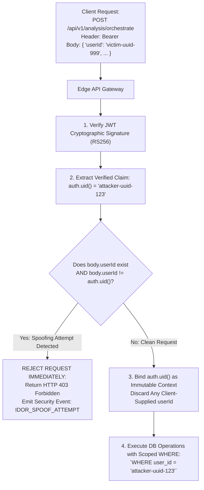

# AayurFace — Security Architecture Specification
## Strict Resource Ownership & Server-Side Identity Derivation

**Phase:** Phase 03 — Enterprise Security, Privacy, Threat Modeling & AI Safety Architecture  
**Date:** 2026-09-03  
**Status:** FORMAL ARCHITECTURAL SPECIFICATION (Target Design; Implementation Pending)  
**Authority:** Security Architect, Staff Backend Architect, Principal Software Architect  

---

### 1. The Server-Side Identity Derivation Invariant

The most critical architectural defense against Broken Object Level Authorization (BOLA / IDOR) is the **Zero-Trust Identity Invariant**:

> [!CRITICAL]
> **Server-Side Identity Derivation Rule**  
> Under NO circumstances shall an API endpoint, Edge Function, or database query accept or trust a client-supplied user identifier (e.g., `request.body.userId`, `?userId=...`, or path parameter) as proof of ownership or authorization.  
> The server **MUST** derive identity exclusively from the cryptographically verified JWT payload claim (`auth.uid()`). Any client request that supplies a mismatched `userId` in the body or URL shall be immediately rejected with HTTP 403 Forbidden or HTTP 404 Not Found.

---

### 2. User-Owned Resource Ownership Schema

| Resource Entity | Owning Foreign Key | Storage Location | API-Level Ownership Check | PostgreSQL RLS Enforcement | Service-Level Authorization Constraint |
|---|---|---|---|---|---|
| **User Profile** | `profiles.id` | PostgreSQL | Direct equality: `auth.uid() = params.id` | `USING (auth.uid() = id)` | Client cannot update `role` or `is_verified` columns. |
| **Consent Log** | `consents.user_id` | PostgreSQL | Derived: `user_id = auth.uid()` | `USING (auth.uid() = user_id)` | Append-only; users cannot delete historical consent tombstones. |
| **Questionnaire** | `questionnaire_responses.user_id` | PostgreSQL | Derived: `user_id = auth.uid()` | `USING (auth.uid() = user_id)` | Bound to active user session; cannot submit on behalf of others. |
| **Lifestyle Context** | `lifestyle_contexts.user_id` | PostgreSQL | Derived: `user_id = auth.uid()` | `USING (auth.uid() = user_id)` | Validated against active session UUID. |
| **Facial Capture (S3)** | S3 Key Prefix: `{userId}/*` | Private S3 Bucket | Edge Function validates signed upload path matches `auth.uid()` | S3 Object Metadata tag: `owner = auth.uid()` | Signed URLs restricted to exact folder prefix `{auth.uid()}/*`. |
| **Analysis Snapshot** | `scan_results.user_id` | PostgreSQL | Derived: `user_id = auth.uid()` | `USING (auth.uid() = user_id)` | Immutable records; UPDATE operations return zero rows. |
| **Daily Routines** | `routines.user_id` | PostgreSQL | Derived: `user_id = auth.uid()` | `USING (auth.uid() = user_id)` | User can only query and modify rituals assigned to their UUID. |
| **Adherence Logs** | `routine_tracking.user_id` | PostgreSQL | Derived: `user_id = auth.uid()` | `USING (auth.uid() = user_id)` | Date-indexed logs strictly scoped to `auth.uid()`. |
| **PDF Wellness Report** | S3 Key Prefix: `reports/{userId}/*` | Private S3 Bucket | Ephemeral generation token verified against `auth.uid()` | S3 path isolation | Reports accessible only via authenticated signed download URLs. |
| **Public Share Link** | `shared_reports.token_hash` | PostgreSQL | Token lookup + optional passcode verification | Shared view policy | Scoped read-only snapshot; excludes raw facial images & PII. |
| **Voice Session** | In-Memory Session ID | Client RAM / Edge | Web Speech session mapped to active JWT | N/A (Ephemeral) | Audio streams never cross-pollinate user sessions. |

---

### 3. BOLA / IDOR Anti-Enumeration Policy

When a user attempts to access a specific resource by UUID (e.g., `GET /api/v1/analysis/3fa85f64-5717-4562-b3fc-2c963f66afa6`), the system enforces an anti-enumeration defense:
* If the resource does not exist: Return `HTTP 404 Not Found`.
* If the resource exists but belongs to another user: **Return `HTTP 404 Not Found`** (NOT `HTTP 403 Forbidden`).
* **Security Rationale:** Returning `HTTP 403` informs an attacker that a resource with that UUID exists, facilitating valid ID enumeration and targeting. Returning `HTTP 404` completely conceals the existence of other tenants' data.
