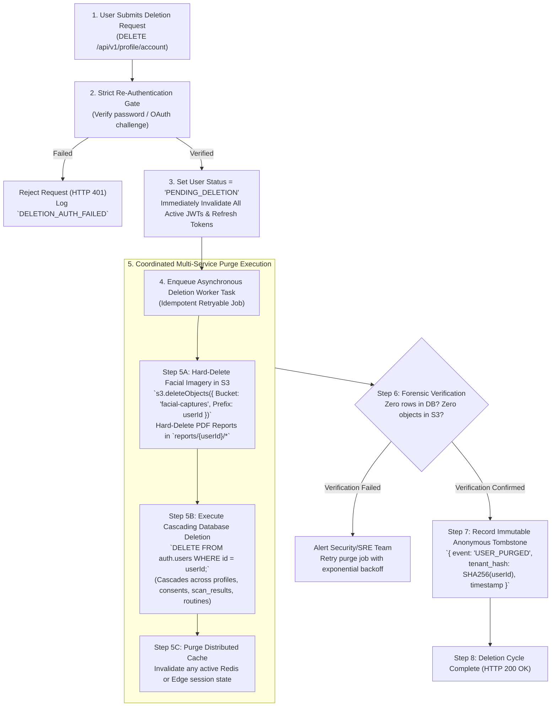

# AayurFace — Security Architecture Specification
## Data Retention Schedules & Cascading Deletion Architecture

**Phase:** Phase 03 — Enterprise Security, Privacy, Threat Modeling & AI Safety Architecture  
**Date:** 2026-09-03  
**Status:** FORMAL ARCHITECTURAL SPECIFICATION (Target Design; Implementation Pending)  
**Authority:** Privacy Officer, Principal Data Architect, Security Architect  

---

### 1. Master Data Retention Matrix

| Data Asset | Storage Location | Processing Purpose | Retention Policy / Schedule | Deletion Trigger | Deletion Method | Backup Implications | Audit Trail Requirement |
|---|---|---|---|---|---|---|---|
| **User Account & Auth** | `auth.users` | Authentication & identity. | Active account lifespan. | User account deletion. | Hard delete from `auth.users`; invalidates all JWTs/refresh tokens. | Purged from production immediately; rolled off encrypted backups within 30 days. | Log anonymous deletion tombstone: `{ user_hash, timestamp }`. |
| **Profile Metadata** | `profiles` | Display name, preferences. | Active account lifespan. | User account deletion. | SQL `ON DELETE CASCADE` via foreign key reference. | Rolled off 30-day backups. | Tombstone audit entry. |
| **Raw Facial Image** | Private S3 Bucket (`facial-captures/`) | Biometric landmarking & feature extraction. | **OPEN DECISION (DEC-004)** Option A: Immediate post-extraction purge. Option B: Rolling 30 days. | Extraction completion OR 30-day lifecycle expiry OR account deletion. | S3 `DeleteObject` API call; S3 Bucket Lifecycle automated purge rule. | S3 bucket excluded from long-term database backups. | Emit `BIOMETRIC_ASSET_PURGED` event with object UUID. |
| **Visual Observations** | `scan_results` (Postgres) | Derived numerical vectors (a*, GLCM, Melanin). | Active account lifespan. | User account deletion. | SQL `ON DELETE CASCADE`. | Rolled off 30-day backups. | Tombstone audit entry. |
| **Questionnaire Answers** | `questionnaire_responses` | Baseline constitutional scoring. | Active account lifespan. | User account deletion. | SQL `ON DELETE CASCADE`. | Rolled off 30-day backups. | Tombstone audit entry. |
| **Lifestyle Context** | `lifestyle_contexts` | Dynamic lifestyle context vectors. | Active account lifespan. | User account deletion. | SQL `ON DELETE CASCADE`. | Rolled off 30-day backups. | Tombstone audit entry. |
| **Analysis Results** | `scan_results` | Historical timeline & progress tracking. | Active account lifespan. | User account deletion. | SQL `ON DELETE CASCADE`. | Rolled off 30-day backups. | Tombstone audit entry. |
| **Routines & Tracking** | `routines`, `routine_tracking` | Daily ritual scheduling & adherence. | Active account lifespan. | User account deletion. | SQL `ON DELETE CASCADE`. | Rolled off 30-day backups. | Tombstone audit entry. |
| **Exported PDF Reports** | S3 Bucket (`reports/`) | Downloadable wellness summaries. | 7 days ephemeral cache (Proposed). | Lifecycle rule expiry (7d) OR account deletion. | S3 automated lifecycle rule `Expiration: 7 Days`. | Excluded from cold backups. | Emit `REPORT_EXPIRED` event. |
| **Shared Report Tokens** | `shared_reports` | Publicly shared read-only links. | 30 days or manual revocation. | User revocation OR token expiration. | SQL `DELETE` or `expired_at < NOW()`. | Rolled off 30-day backups. | Log revocation event. |
| **Voice Audio Stream** | Browser RAM | Conversational voice queries (V2). | 0 seconds (Purely ephemeral). | End of speech utterance. | Instant memory garbage collection in client browser RAM. | Never reaches server or backups. | Telemetry logs query latency only; zero audio. |
| **Application Logs** | Observability SIEM Sink | Operational APM & debugging. | 30 days rolling. | Automated lifecycle rule. | WORM log stream automated rotation. | Retained in log archive 30 days. | Standard system telemetry. |
| **Security Audit Logs** | Dedicated WORM Vault | Compliance & incident investigation. | 1 year minimum. | WORM retention rule (365 days). | Immutable retention policy expiration. | Archived in encrypted cold WORM vault. | Tamper-evident hash chain. |
| **Research Datasets** | `research_subjects`, `expert_annotations` | Algorithm calibration & bias audits. | Permanent benchmark life. | Subject research consent withdrawal. | De-identified records retained as anonymous mathematical benchmark. | Included in secure research snapshots. | Log subject withdrawal ID. |
| **Database Backups** | Encrypted S3 Cold Storage | Disaster recovery & business continuity. | 30 days rolling. | Snapshot rotation rule (30d). | Automated point-in-time snapshot expiration. | Backups rotate out automatically after 30 days. | Log backup rotation event. |

---

### 2. Cascading Data Deletion State Machine

Account deletion is an irreversible, multi-service security operation executed via an asynchronous idempotent state machine:

---

### 3. Backup Retention Implications & Handling

A critical technical reality of database backups is that automated point-in-time snapshots contain data that was active at the time of snapshot creation:
1. **The 30-Day Roll-Off Standard:** When a user account is purged from the live production database, the data remains within encrypted rolling daily backup snapshots for a maximum of 30 days, after which the snapshot files are permanently and automatically deleted by the cloud retention policy.
2. **Restoration Quarantine Invariant:** If a disaster recovery event necessitates restoring the database from a backup snapshot, an automated post-restoration reconciliation script must execute immediately before routing traffic:
   * The script queries the immutable anonymous tombstone vault (`consents` / audit logs) for all `USER_PURGED` events recorded after the snapshot timestamp.
   * The script immediately re-executes the hard-purge query for those restored user IDs, ensuring that previously deleted users are never resurrected into the live system.
